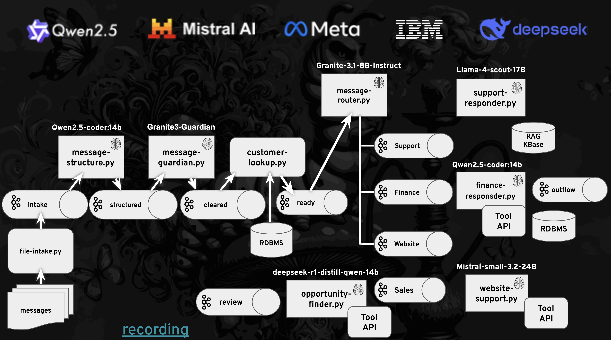

# AI Message Triage

A Kafka-based system for automated email message analysis and triage using LLMs (Large Language Models). This project processes customer support emails through a pipeline that analyzes content, extracts key information, and routes messages based on their characteristics.

Note: This is a totally "hacked together" codebase.  Needs an investment of time to really analyze the input/output Pydantic message definitions.  Python's dynamic typing makes for some more interesting debugging opportunities when the str, dict and Pydantic models are not aligned perfectly.   A proper microservices architecture would have very strict rules over the message JSON schema making for easier testing interoperability. 

## Features

- Kafka-based message processing pipeline
- LLM-powered email analysis
- Automatic extraction of:
  - Customer information
  - Email content
  - Sentiment analysis
  - Product references
  - Escalation requirements
- Real-time message routing
- Error handling and message review system

## Architecture

A series of processors that take input, often send it through a LLM and produce output.



opportunity-finder.py uses a reasoning model to generate code instead of using a simplier and more robust solution of Structured Output or Tool. 


## ToDos

The Kafka input/output is fairly boilerplate and has been copied & pasted hither and yon.  Having common/shared code
would be better for maintenance and for debugging.  Also, this has mostly been tested for "happy path", more robust error and exception processing would be very helpful.

The Pydantic Models grew organically while I was hacking away. They need to be "normalized" a fair bit.


## Prerequisites

- Python 3.x
- Apache Kafka
- OpenAI API compatible service
- Python dependencies (see requirements.txt)

## Environment Variables

Copy `.env.example` file and edit


## Usage

1. install, start and configure your Kafka broker

```
brew install kafka
brew services start zookeeper
brew services start kafka
```

List of Topics:

```
/opt/homebrew/bin/kafka-topics --bootstrap-server localhost:9092 --list 
```

Delete & Create the Topics if needed:

```
chmod +x reset.sh
./reset.sh
```

2. Set up your environment variables

```
cp .env.example .env
```

Edit accordingly

3. Install dependencies

```
pip install -r requirements.txt
```

## End to End (E2E) Demo

### Intake 

```bash
python -m intake.file-intake
```

```bash
./kcat-clear.sh intake
```

### Structured

```bash
python -m structure.message-structure
```

```bash
./kcat-clear.sh structured
```

### Guardian

```bash
python -m guardian.message-guardian
```

```bash
./kcat-clear.sh cleared
```

### Customer

```bash
python -m customer.customer-lookup
```

```bash
./kcat-clear.sh ready
```


### Router

```bash
python -m router.message-router
```

```bash
./kcat-clear.sh support
```

```bash
./kcat-clear.sh finance
```

```bash
./kcat-clear.sh website
```

### Support

```bash
./kcat-clear.sh support
```

```bash
python -m support.support-responder
```

```bash
./kcat-clear.sh outflow
```

### Website

```bash
./kcat-clear.sh website
```

```bash
python -m website.website-support
```

```bash
cd website
python api-runner.py
```
Or dev mode `uvicorn password-reset-api:app --reload`


```bash
./kcat-clear.sh outflow
```

### Finance

```bash
./kcat-clear.sh finance
```

```bash
python -m finance.finance-responder
```

```bash
cd finance
python api-runner.py
```

```bash
./kcat-clear.sh outflow
```


### Opportunity

```bash
./kcat-clear.sh review
```

```bash
python -m opportunity.opportunity-finder
```

```bash
./kcat-clear.sh sales
```


**Drag and drop a file to "intake" directory**


## Debugging

What models are available at the endpoint:

```
curl $INFERENCE_SERVER_URL/models \
  -H "Authorization: Bearer $API_KEY" \
  -H "Content-Type: application/json"
```

Inference check

```
curl -sS $INFERENCE_SERVER_URL/chat/completions \
  -H "Content-Type: application/json" \
  -H "Authorization: Bearer $API_KEY" \
  -d "{
     \"model\": \"$MODEL_NAME\",
     \"messages\": [{\"role\": \"user\", \"content\": \"Who is Burr Sutter?\"}],
     \"temperature\": 0.0
   }" | jq -r '.choices[0].message.content'
```

## Error Handling

The system includes robust error handling:
- Failed messages are routed to a review topic
- Errors are logged with detailed information
- System maintains processing despite individual message failures

## Logging

The application uses Python's logging module with:
- Timestamp
- Log level
- Detailed message information
- Processing status updates

## License

This project is licensed under the Apache License 2.0 - see the [LICENSE.txt](LICENSE.txt) file for details. 